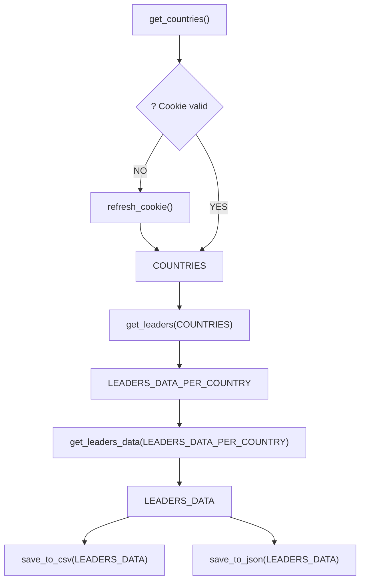

# Wikipedia Scraper Countries and their leaders

This project contains a wikipedia scraper that looks for countries, their leader and fetches a short bio on their personal Wikipedia page.

For that we will query an API to obtain a list of countries and their past political leaders.

The start url is https://country-leaders.onrender.com.

The API documentation is available at https://country-leaders.onrender.com/docs


# Workflow

## Code logic flow chart:



# Installation

1. In a new folder clone the repo

```bash
git clone git@github.com:NathNacht/wikipedia-scraper-countries-and-leaders.git
```

2. Install the requirements

```bash
pip install -r requirements.txt
```

3. Run the script

```bash
$ python3 main.py
```


### Result

Find the results in the data folder: `leaders_data.json` and `leaders_data.csv`


# Usage

- This program starts from https://country-leaders.onrender.com/countries to fetch the countries.
- Next it fetches the leaders from each country
- End result is a .json and a .csv file that countains the countries, leaders (first_name, last_name), their wikipedia page and a short bio.


# Timeline

This project was created in 3 days

# Personal situation

This project was made as an assignment in the BeCode course: Data AI operator.


